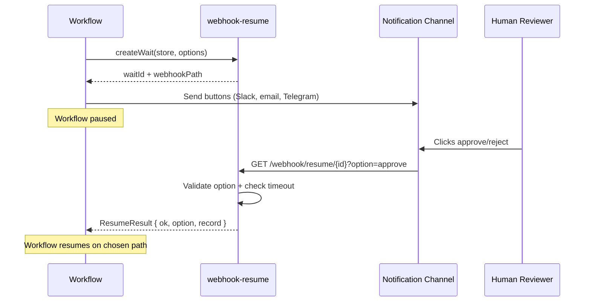

<p align="center">
  
</p>

<p align="center">
  <a href="https://github.com/protectyr-labs/webhook-resume/actions/workflows/ci.yml"></a>
  <a href="LICENSE"></a>
  <a href="https://www.typescriptlang.org/"></a>
  <a href="package.json"></a>
</p>

<p align="center">
  Pause workflows, wait for human decisions, resume via webhook.<br>
  Storage-agnostic approval gates with timeout and multi-option routing.
</p>

---

## Quick Start

```bash
npm install @protectyr-labs/webhook-resume
```

```typescript
import { createWait, resume, buildCallbackUrls, createInMemoryStore } from '@protectyr-labs/webhook-resume';

const store = createInMemoryStore();

// Create a decision point with timeout
const wait = await createWait(store, {
  workflowId: 'deploy-prod-v2.1',
  options: ['approve', 'reject'],
  timeoutMs: 60 * 60 * 1000,
});

// Build button URLs for Slack/email/Telegram
const urls = buildCallbackUrls('https://api.yourapp.com', wait.waitId, ['approve', 'reject']);
// => { approve: "https://api.yourapp.com/webhook/resume/<id>?option=approve", ... }

// When the human clicks, resume the workflow
const result = await resume(store, wait.waitId, 'approve');
// => { ok: true, option: 'approve', record: { ... } }
```

## How It Works



## Why This Exists

Async workflows hit decision points that only a human can resolve: deployment approvals, content sign-offs, expense authorizations. The standard options are polling (wasteful, adds latency) or manual webhooks (error-prone, no timeout handling).

This library provides the minimal correct primitive: create a wait point, send URLs to the reviewer, resume when they respond. It validates options, enforces timeouts, prevents double-resolution, and stays out of your storage and notification choices.

## Use Cases

**Deployment gates** -- CI pipeline reaches production deploy. Team lead gets a notification with Approve/Reject. Pipeline waits, then proceeds or rolls back.

**Content approval** -- AI drafts a blog post. Editor receives it via Slack with Approve/Reject/Edit buttons. Workflow pauses until they decide.

**Expense authorization** -- Employee submits an expense. Manager gets an email with Approve/Deny links. One click resolves the workflow.

**Multi-reviewer chains** -- Document needs sign-off from legal, then compliance, then management. Create sequential wait points for each reviewer.

## API

| Function | Purpose |
|----------|---------|
| `createWait(store, opts)` | Create a wait point with options, timeout, and metadata |
| `resume(store, waitId, option)` | Resume with the human's decision (validates option + expiry) |
| `buildCallbackUrls(base, waitId, options)` | Generate full callback URLs for notification buttons |
| `createInMemoryStore()` | In-memory `WaitStore` for dev/testing |

### WaitStore Interface

```typescript
interface WaitStore {
  create(record: WaitRecord): Promise<void>;
  get(id: string): Promise<WaitRecord | null>;
  resolve(id: string, option: string): Promise<WaitRecord>;
  expire(id: string): Promise<void>;
}
```

Implement this interface for your backend: PostgreSQL, Redis, DynamoDB, SQLite, or anything else. The library never touches your database directly.

## Patterns

### Content Approval (3 options)

```typescript
const wait = await createWait(store, {
  workflowId: 'blog-post-42',
  options: ['approve', 'reject', 'request_edits'],
  timeoutMs: 24 * 60 * 60 * 1000,
  metadata: { title: 'New Blog Post' },
});
```

### Express Webhook Handler

```typescript
app.get('/webhook/resume/:waitId', async (req, res) => {
  const result = await resume(store, req.params.waitId, req.query.option);
  result.ok ? res.send('Decision recorded.') : res.status(400).send(result.error);
});
```

## Design Decisions

### ADR-001: Webhooks over polling

Polling requires background timers and repeated database queries. Webhooks fire instantly when the human acts, use zero resources while waiting, and need only a single HTTP endpoint. The workflow is truly idle until the callback arrives.

### ADR-002: Storage-agnostic WaitStore interface

The four-method `WaitStore` interface (`create`, `get`, `resolve`, `expire`) keeps the core logic portable and testable. Use the built-in in-memory store for development; swap in your production database without changing application code. The interface deliberately omits `list`, `search`, and `delete` because those are application concerns.

### ADR-003: Upfront option validation

Valid options are declared at wait creation time. The `resume` function rejects any option not in that list. This catches typos in webhook parameters, blocks malicious callbacks injecting unexpected values, and invalidates stale buttons from old notification versions.

### ADR-004: Immutable state transitions

A wait record follows exactly one path: `pending -> completed` (human responded) or `pending -> expired` (timeout). There is no reopening, no changing the selected option, no moving from expired back to pending. The first valid response wins. This eliminates race conditions when two people click different buttons.

### ADR-005: Timeout as a first-class concept

Approval requests should not live forever. A deployment gate from two weeks ago should not fire when someone finds an old email. Expired waits return a clear error, old webhook URLs become inert, and stores can garbage-collect expired records. Timeouts are optional for waits that genuinely need indefinite lifetime.

## Limitations

- **Single resolver** -- one person resolves each wait point; no quorum or voting
- **No partial approval** -- all-or-nothing decision, no "approve with conditions"
- **No built-in retry** -- if the webhook delivery fails, the caller must retry
- **No built-in notification** -- the library generates URLs but does not send messages
- **In-memory store is ephemeral** -- implement `WaitStore` for persistence in production

> [!NOTE]
> For multi-party approval (3 of 5 must approve), compose multiple sequential waits. For retry logic, implement idempotency at the handler level. These are intentional scope boundaries that keep the library focused.

## Origin

Built at [Protectyr Labs](https://github.com/protectyr-labs) to solve a recurring problem in automation pipelines: workflows that need human judgment at specific decision points without losing state or requiring manual restart. Extracted from production n8n and CI/CD integrations where deployment gates, content approvals, and incident response escalations all needed the same pause/validate/resume primitive.

## See Also

- [funnel-state](https://github.com/protectyr-labs/funnel-state) -- validated customer lifecycle state machine
- [sse-lock](https://github.com/protectyr-labs/sse-lock) -- SSE streaming with concurrency control

## License

MIT
